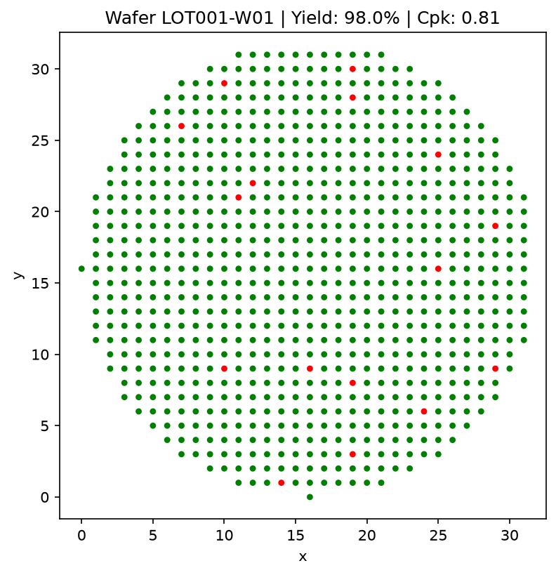
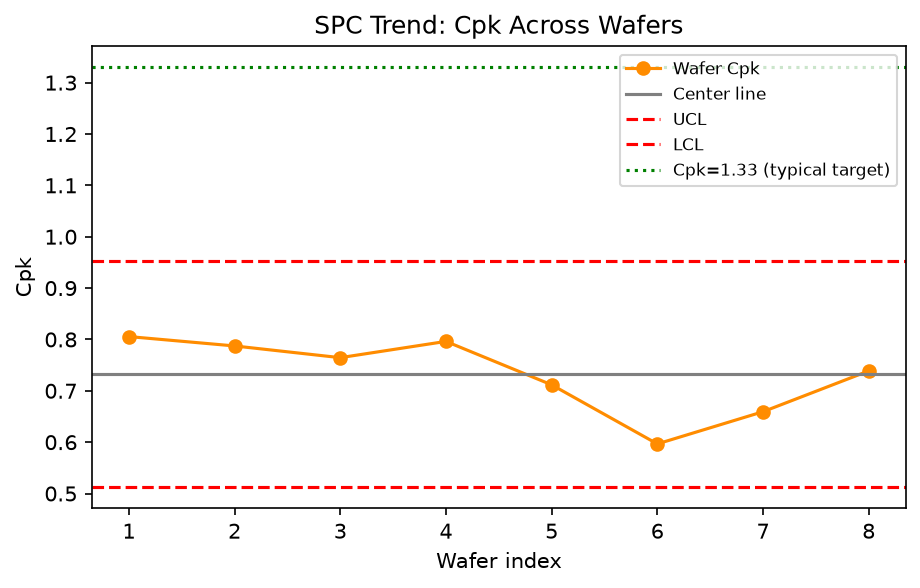

# Semiconductor Wafer Yield & Process Health Analytics

A Python analytics pipeline that simulates semiconductor wafer probe test data and runs it through the same kind of statistical process control (SPC) and yield analysis used in real fabs — computing Cp/Cpk, generating wafer maps, and flagging process drift **before** it shows up as a yield loss.

There's no real fab data behind this (wafer test data is proprietary), so the pipeline starts by generating statistically realistic synthetic data — die-level Vth/leakage/delay measurements with wafer-to-wafer drift, edge effects, and random defects — and then analyzes it exactly as if it came from a tester.

## Why this exists

Semiconductor manufacturing yield depends on catching process variation early. This project is a self-contained demonstration of that workflow, end to end:

1. **Simulate** a realistic wafer lot (multiple wafers, hundreds of dies each, spec-limit pass/fail binning).
2. **Analyze** it with standard SPC statistics (yield, mean/std, Cp/Cpk, control limits).
3. **Visualize** it with wafer maps and cross-wafer SPC trend charts.
4. **Diagnose** it with a rule-based process health report (edge effects, Cpk drift, leakage variance).
5. **Predict** trouble early with a deterministic early-warning system that flags leading indicators (shrinking Cpk, mean drift toward spec, growing variance) before yield actually drops.

Every metric is a closed-form statistical calculation or a documented threshold rule — no black-box ML — so every number in the output is traceable back to a formula.

## Pipeline architecture

```
wafer_data_generator.py   →   wafer_spc_analysis.py   →   wafer_early_warning.py
   synthetic die data          yield / Cp / Cpk /            leading-indicator trend
   (Lot → Wafer → Die)         wafer maps / SPC trends /     rules → risk score
                                process health report         (LOW → CRITICAL)
                                        │
                                        └──────────► run_pipeline.py (orchestrates all steps)
```

| Module | Responsibility |
|---|---|
| `wafer_data_generator.py` | Generates die-level test data for a lot: circular wafer grid, per-wafer Vth mean shift (process drift), lognormal leakage with edge-effect and random point-defect behavior, delay correlated to Vth, and spec-limit-based pass/fail + bin labeling. |
| `wafer_spc_analysis.py` | Computes per-wafer and per-lot yield, Cp/Cpk capability metrics, renders wafer maps (pass/fail scatter) and SPC trend charts with 3-sigma control limits, and produces a rule-based "Process Health Report" (edge effects, Cpk drift, leakage variance anomalies). |
| `wafer_early_warning.py` | Sits on top of the SPC layer without modifying it. Runs 5 independent trend-based signals (Cpk degradation, mean drift toward a spec limit, variance growth, edge-fail escalation, yield/capability mismatch) and rolls them into a transparent, auditable risk score (LOW / MODERATE / HIGH / CRITICAL). |
| `run_pipeline.py` | Driver script that ties all three stages together into one run and prints/saves every artifact. |

## Sample output

Running the pipeline on a synthetic 8-wafer lot (`LOT001`, 6,360 dies) produces:

**Yield & SPC summary**

```
    wafer_id  n_dies  n_pass  yield_pct
  LOT001-W01     795     779    97.99%
  LOT001-W02     795     772    97.11%
  LOT001-W03     795     766    96.35%
  LOT001-W04     795     773    97.23%
  LOT001-W05     795     766    96.35%
  LOT001-W06     795     754    94.84%
  LOT001-W07     795     765    96.23%
  LOT001-W08     795     773    97.23%

Lot yield: 96.67% (6148 / 6360 dies)
```

**Process Health Report**

```
============================================================
PROCESS HEALTH REPORT -- Lot LOT001
============================================================
Lot yield: 96.67% (6148/6360 dies)
Wafer yield spread: 94.8% - 98.0% (std 0.95 pts)
Lot avg Cpk: 0.73 (min 0.60, max 0.81)
------------------------------------------------------------
FLAGGED ISSUES:
  - CPK DRIFT DETECTED: Cpk is declining across the lot at a rate of
    -0.020 per wafer. Process drift suspected -- check equipment
    calibration / consumable wear over the lot run.
============================================================
```

**Process Early Warning Report**

```
============================================================
PROCESS EARLY WARNING REPORT
============================================================
Risk Level: MODERATE  (rule score: 1)
------------------------------------------------------------
Observed Signals:
  - Process mean Vth drifting toward LSL (margin shrinking at
    -0.0010 V/wafer, current margin 0.044 V). Process mean drifting
    toward specification boundary.
------------------------------------------------------------
Assessment:
Early indicators of process change detected. Recommend continued
monitoring; no immediate action required.
============================================================
```

**Wafer map** (pass/fail scatter, green = pass, red = fail)



**SPC trend across wafers** (Cpk vs. wafer index, with 3-sigma control limits)



## What the early-warning system actually checks

The risk engine is fully rule-based and auditable — every threshold lives in a single `EarlyWarningConfig` dataclass, and the final score is just arithmetic over which rules fired:

1. **Cpk degradation** — declining slope or 3+ consecutive drops in Cpk across wafers.
2. **Mean drift** — the process mean creeping toward the nearer spec limit.
3. **Variance growth** — Vth standard deviation trending upward (a precursor to future Cpk loss).
4. **Edge-fail escalation** — fail rate among edge-zone dies climbing lot-over-lot (points to edge etch/deposition non-uniformity).
5. **Yield/capability mismatch** — the highest-value signal: yield still looks fine, but Cpk is deteriorating underneath it, meaning trouble is developing that today's yield number won't show yet.

Each fired signal adds to a transparent score (`0` = LOW, up to `5+` = CRITICAL), with severity multipliers for signals that fire strongly rather than marginally.

## Getting started

```bash
pip install -r requirements.txt
python run_pipeline.py
```

This generates a fresh synthetic lot, prints the yield/SPC tables and both reports to the console, and saves the wafer-map and SPC-trend PNGs to the project root.

**Requirements:** Python 3.9+, `numpy`, `pandas`, `matplotlib`.

## Project structure

```
.
├── wafer_data_generator.py    # Step 1: synthetic wafer/die data generation
├── wafer_spc_analysis.py      # Step 2/3: yield, Cp/Cpk, wafer maps, SPC trends, health report
├── wafer_early_warning.py     # Step 4: trend-based leading-indicator risk assessment
├── run_pipeline.py            # Orchestrates the full pipeline end to end
└── requirements.txt
```

## Design notes

- **Reproducible**: a single seeded `numpy` RNG drives the entire lot, so results are deterministic given the same seed.
- **Separation of concerns**: data generation, SPC analytics, and early-warning detection are independent modules — the early-warning layer consumes the SPC layer's output without modifying it.
- **No black boxes**: yield, Cp/Cpk, and every early-warning signal are closed-form statistics or documented threshold rules, not a trained model — every number in a report can be traced back to a formula in the source.
- **Realistic defect modeling**: leakage failures come from two independent, physically-motivated mechanisms — a spatial edge effect (etch/deposition non-uniformity near the wafer boundary) and random point defects (particle contamination) — rather than uniform noise.

## Possible extensions

- Multi-lot trend tracking (currently analyzes one lot at a time)
- A simple web dashboard (e.g. Streamlit) over the existing report functions
- Swapping the rule-based early-warning layer for a learned model, with the current rules as a labeled baseline/ground truth
